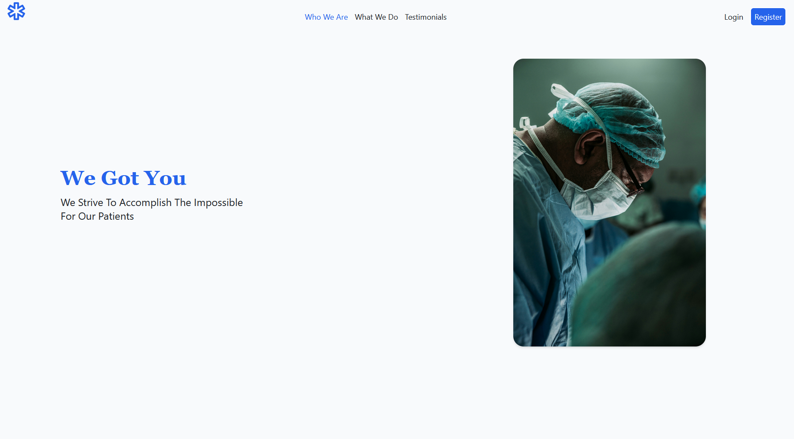
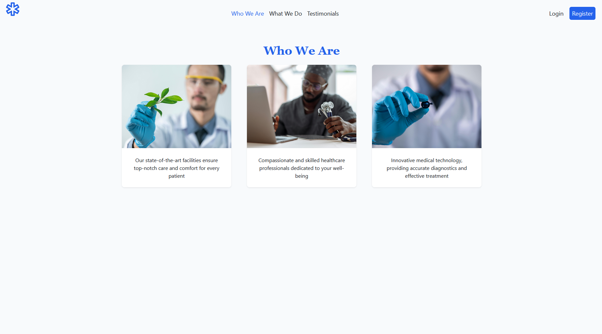
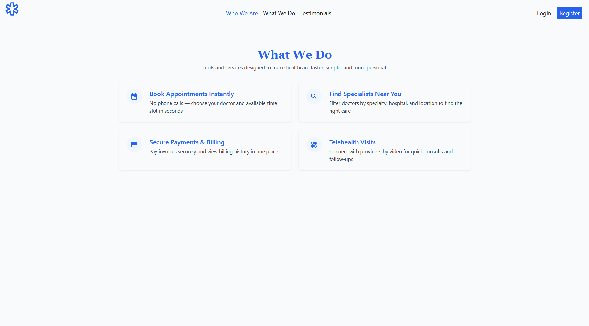
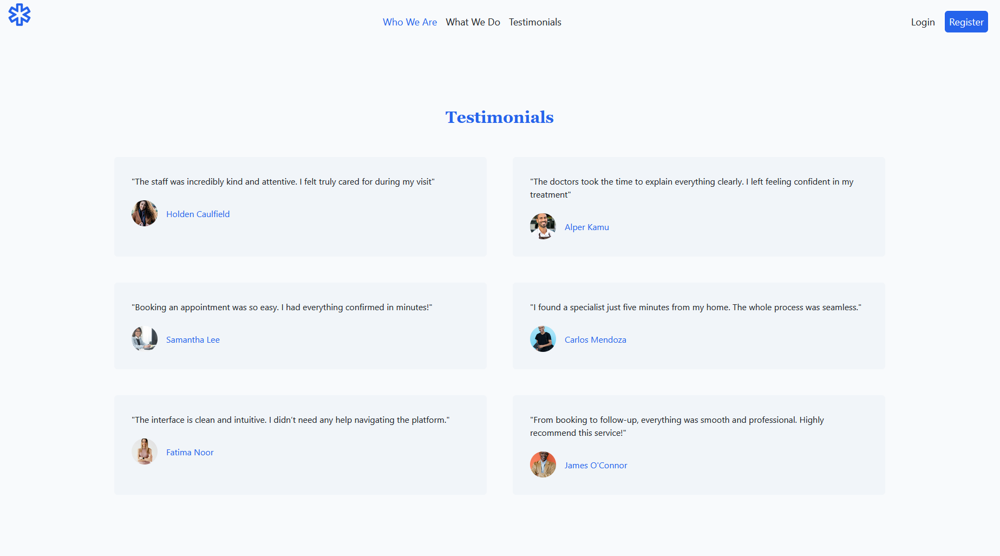
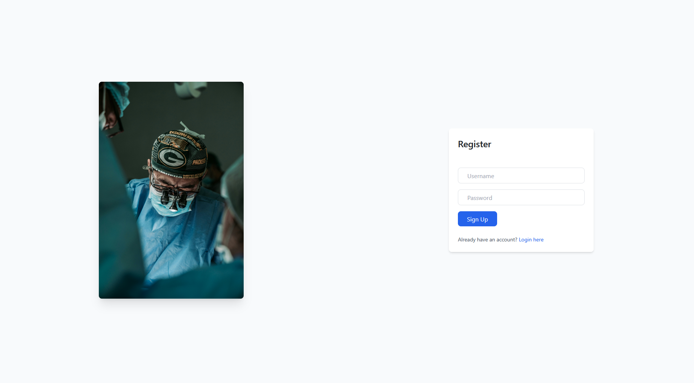
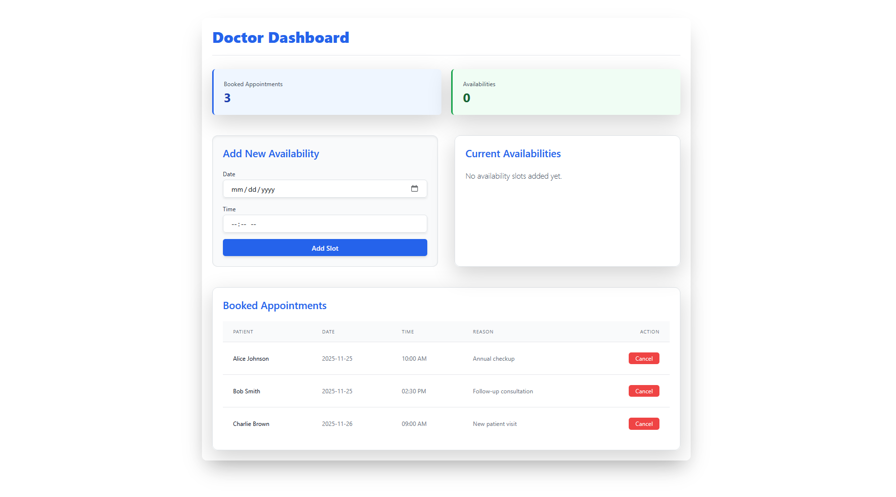
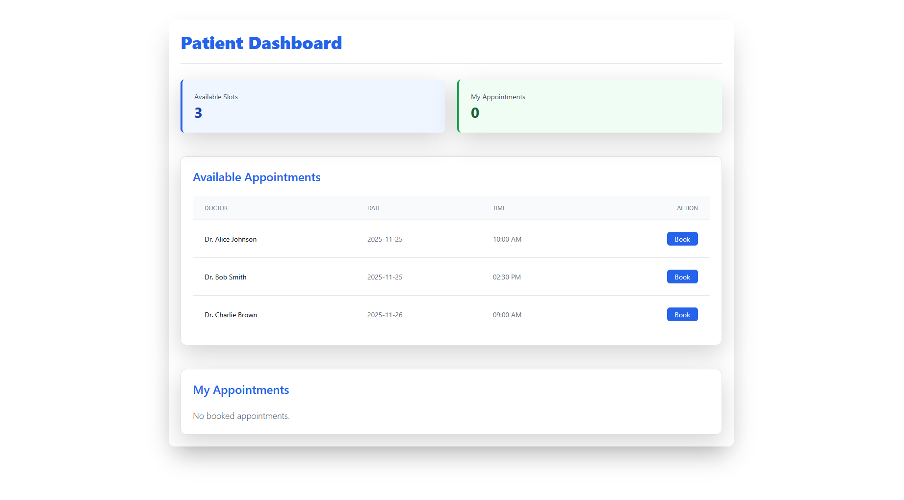
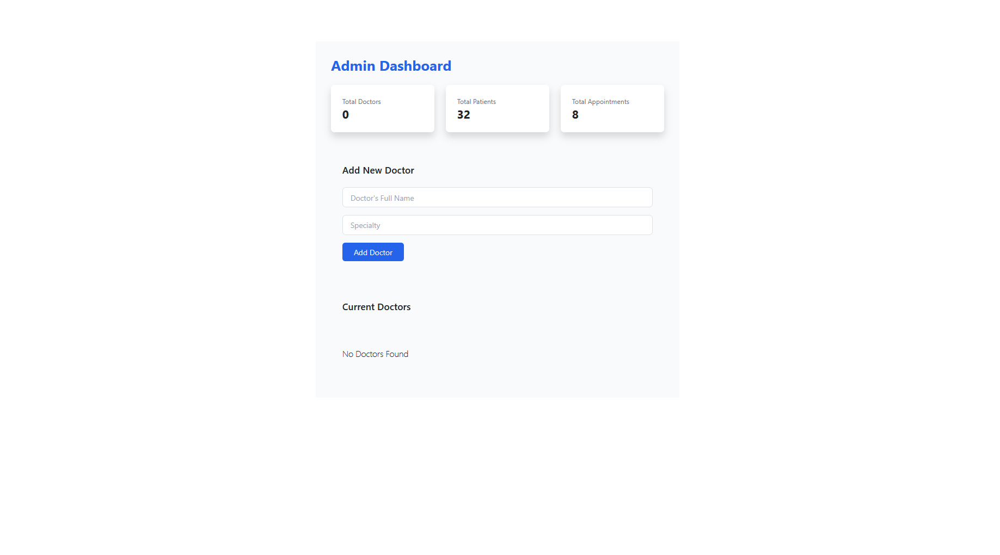

# web2-hospital-project

Simple hospital website built with React and Tailwind

## Project description

- A small React app demonstrating a landing site for a hospital: hero, features, about, testimonials, and basic auth pages.
- Uses React Router for page navigation and Tailwind CSS for styling.
- Public images are served from the `public/assets` folder.

## Setup

Prerequisites: Node.js (16+) and npm.

1. Install dependencies

```powershell
npm install
```

2. Run the development server

```powershell
npm start
```

3. Open the app

Open http://localhost:3000 in your browser.

## Project Screenshots:

### Main Page

this page dynamically renders the following components:

#### Hero



#### About



#### Features



#### Testimonials



### Auth Page

this page dynamically renders the following components:

#### Register



#### Login


### Doctor Page



### Patient Page 



### Admin Page



