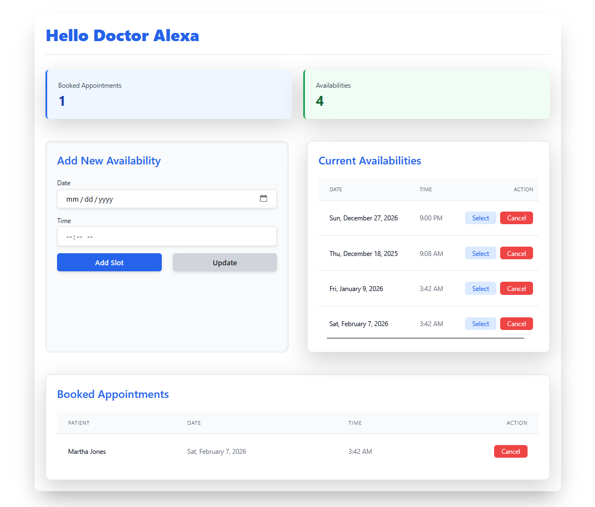
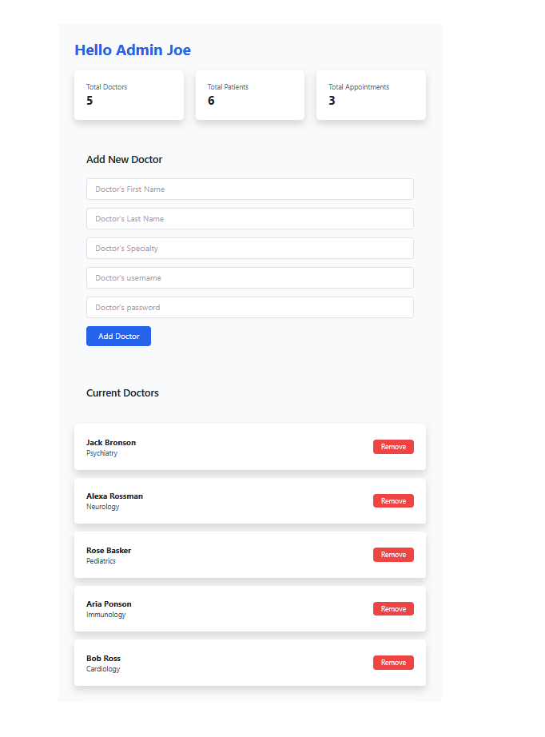

# web2-hospital-project

A hospital website with role-based access built with React and Tailwind CSS.

## Features

- **Landing page** with hero, features, about, and testimonials sections
- **User authentication** with register/login functionality
- **Role-based pages** for doctors, patients, and admins
- **Protected routes** that require authentication
- **Responsive design** using Tailwind CSS

## Getting Started

**Prerequisites:** Node.js (16+) and npm

1. Install dependencies
```powershell
npm install
```

2. Start the development server
```powershell
npm start
```

3. Open http://localhost:3000 in your browser

## Tech Stack

- React with React Router for navigation
- Tailwind CSS for styling
- Global Context API for state management

## Pages

**Public**
- Landing page (hero, features, about, testimonials)
- Register / Login

**Protected** (requires authentication)
- Doctor page
- Patient page  
- Admin page

## Project Screenshots:

### Main Page

this page dynamically renders the following components:

#### Hero


#### About


#### Features


#### Test imonials


### Auth Page

this page dynamically renders the following components:

#### Register


#### Login


### Doctor Page



### Patient Page 


### Admin Page



